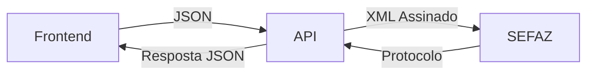

# 📚 Documentação MDF-e - Integração Frontend → API → SEFAZ

## 📖 Índice

Bem-vindo à documentação completa da integração do sistema MDF-e!

---

## 🎯 Para Começar

### 👨‍💻 Desenvolvedor da API (COMECE AQUI)
**Leia primeiro:** [`PARA-O-DEV-DA-API.md`](./PARA-O-DEV-DA-API.md)

Resumo executivo com tudo que você precisa saber para implementar a API.

---

## 📋 Documentação por Categoria

### 1️⃣ Visão Geral

| Documento | Descrição | Para quem |
|-----------|-----------|-----------|
| [`CONFORMIDADE-SEFAZ.md`](./CONFORMIDADE-SEFAZ.md) | ✅ Confirmação padrão SEFAZ | Todos ⭐⭐ |
| [`RESUMO-MUDANCAS-MDFE.md`](./RESUMO-MUDANCAS-MDFE.md) | O que mudou no sistema | Todos |
| [`PARA-O-DEV-DA-API.md`](./PARA-O-DEV-DA-API.md) | Guia rápido para começar | Dev API ⭐ |

### 2️⃣ Formato de Dados

| Documento | Descrição | Para quem |
|-----------|-----------|-----------|
| [`mdfe-json-format.md`](./mdfe-json-format.md) | Especificação completa do JSON | Dev API |
| [`campos-opcionais.md`](./campos-opcionais.md) | Como campos opcionais são tratados | Todos ⭐ |
| [`exemplo-json-enviado.json`](./exemplo-json-enviado.json) | Exemplo real do JSON | Dev API |
| [`exemplo-resposta-api.json`](./exemplo-resposta-api.json) | Formato de resposta esperado | Dev API |

### 3️⃣ Implementação

| Documento | Descrição | Para quem |
|-----------|-----------|-----------|
| [`guia-implementacao-api.md`](./guia-implementacao-api.md) | Guia completo de implementação | Dev API ⭐ |
| [`teste-rapido.md`](./teste-rapido.md) | Como testar o fluxo | Todos |

---

## 🗺️ Fluxo Completo



### Etapas:

1. **Frontend** gera JSON estruturado (✅ Pronto)
2. **API** processa:
   - Valida JSON
   - Converte para XML
   - Assina digitalmente
   - Envia para SEFAZ
3. **SEFAZ** retorna protocolo
4. **API** retorna resposta para Frontend

---

## 📂 Estrutura dos Arquivos

```
docs/
├── README.md                      ← Você está aqui
├── CONFORMIDADE-SEFAZ.md         ⭐⭐ Confirmação padrão SEFAZ
├── PARA-O-DEV-DA-API.md          ⭐ Comece por aqui (API)
├── RESUMO-MUDANCAS-MDFE.md       📝 O que mudou
├── mdfe-json-format.md            📋 Especificação JSON
├── campos-opcionais.md            ✅ Tratamento de campos opcionais
├── guia-implementacao-api.md      🛠️ Guia de implementação
├── exemplo-json-enviado.json      📦 Exemplo de input
├── exemplo-resposta-api.json      📦 Exemplo de output
├── teste-rapido.md                🧪 Como testar
├── teste-api-curl.sh              🔧 Script teste (Linux/Mac)
└── teste-api.ps1                  🔧 Script teste (Windows)
```

---

## 🚀 Quick Start

### Para o Dev da API

1. Leia [`PARA-O-DEV-DA-API.md`](./PARA-O-DEV-DA-API.md)
2. Veja o exemplo em [`exemplo-json-enviado.json`](./exemplo-json-enviado.json)
3. Siga o guia em [`guia-implementacao-api.md`](./guia-implementacao-api.md)
4. Teste seguindo [`teste-rapido.md`](./teste-rapido.md)

### Para o Dev Frontend

1. O código já está pronto! ✅
2. Para entender as mudanças: [`RESUMO-MUDANCAS-MDFE.md`](./RESUMO-MUDANCAS-MDFE.md)
3. Para testar: [`teste-rapido.md`](./teste-rapido.md)

---

## 📊 Status do Projeto

| Componente | Status | Observações |
|------------|--------|-------------|
| Frontend - Geração JSON | ✅ Concluído | Função `generateMDFeJSON()` |
| Frontend - Validação | ✅ Concluído | Função `validateMDFe()` |
| API - Estrutura | ⏳ Pendente | Aguardando implementação |
| API - Validação | ⏳ Pendente | Aguardando implementação |
| API - Conversão XML | ⏳ Pendente | Aguardando implementação |
| API - Assinatura | ⏳ Pendente | Aguardando implementação |
| API - Integração SEFAZ | ⏳ Pendente | Aguardando implementação |
| Testes E2E | ⏳ Pendente | Após API completa |

---

## 🔧 Tecnologias

### Frontend (Implementado)
- ✅ React + TypeScript
- ✅ Electron
- ✅ Validação de campos
- ✅ Geração de JSON

### Backend (A implementar)
- Node.js / Express (sugerido)
- xml2js / fast-xml-parser
- node-forge (assinatura digital)
- soap (SEFAZ Web Service)
- PostgreSQL / MySQL (sugerido)

---

## 📞 Endpoints da API (Sugeridos)

```
POST   /api/mdfe/criar         - Criar e autorizar MDF-e
GET    /api/mdfe/:id           - Consultar MDF-e
POST   /api/mdfe/:id/cancelar  - Cancelar MDF-e
POST   /api/mdfe/:id/encerrar  - Encerrar MDF-e
GET    /api/mdfe/:id/pdf       - Baixar DAMDFE
GET    /api/mdfe/:id/xml       - Baixar XML
```

---

## 🧪 Ambiente de Testes

### SEFAZ Homologação
- Ambiente: `tpAmb = "2"`
- URLs: Disponíveis em [`guia-implementacao-api.md`](./guia-implementacao-api.md)
- Certificado: Usar certificado válido A1/A3

### Dados de Teste
- Ver [`exemplo-json-enviado.json`](./exemplo-json-enviado.json)
- CNPJ: Usar CNPJ válido da empresa
- NF-e: Chaves de 44 dígitos

---

## 📖 Referências Externas

### Oficiais SEFAZ
- 🌐 [Portal MDF-e](http://www.mdfe.fazenda.gov.br/)
- 📄 [Manual v3.00](http://www.mdfe.fazenda.gov.br/portal/manual.aspx)
- 🔧 [Web Services](http://www.mdfe.fazenda.gov.br/portal/webServices.aspx)
- 📋 [Schemas XML](http://www.portalfiscal.inf.br/mdfe)

### Comunidade
- Stack Overflow: Tag `mdfe`
- GitHub: Buscar `mdfe node`

---

## ❓ FAQ

### P: Onde está o código do frontend?
**R:** Em `src/renderer/utils/mdfeValidator.ts` (função `generateMDFeJSON`)

### P: Qual o formato do JSON enviado?
**R:** Ver [`exemplo-json-enviado.json`](./exemplo-json-enviado.json)

### P: Como a API deve responder?
**R:** Ver [`exemplo-resposta-api.json`](./exemplo-resposta-api.json)

### P: Preciso de certificado digital?
**R:** Sim! A1 ou A3 para assinar o XML antes de enviar para SEFAZ

### P: Funciona em produção?
**R:** Alterar `tpAmb` de `"2"` para `"1"` em `mdfeValidator.ts` linha 289

### P: Como testar?
**R:** Seguir [`teste-rapido.md`](./teste-rapido.md)

---

## 🐛 Problemas Comuns

### Frontend

**Erro: "Pelo menos uma nota fiscal deve ser adicionada"**
- Adicionar NF-e na aba Documentos

**Erro: "Placa do veículo é obrigatória"**
- Formato correto: ABC1234 ou ABC1D23

### API (Futuro)

**Erro 217: NF-e não encontrada**
- Validar chave NF-e (44 dígitos)
- Verificar se NF-e está autorizada na SEFAZ

**Erro 225: Falha no Schema**
- Validar XML gerado contra schema SEFAZ

**Erro 401: CPF inválido**
- Validar formato e dígitos verificadores

---

## 📝 Changelog

### v1.0.0 (12/11/2025)
- ✅ Implementado geração de JSON no padrão SEFAZ
- ✅ Criada documentação completa
- ✅ Adicionados exemplos práticos
- ✅ Guia de implementação para API

---

## 👥 Contribuindo

### Encontrou um erro?
Abra uma issue descrevendo o problema.

### Tem sugestões?
Pull requests são bem-vindos!

---

## 📄 Licença

Este projeto é parte do sistema interno da empresa.

---

## 🎓 Glossário

- **MDF-e**: Manifesto Eletrônico de Documentos Fiscais
- **SEFAZ**: Secretaria da Fazenda
- **DAMDFE**: Documento Auxiliar do MDF-e (PDF)
- **NF-e**: Nota Fiscal Eletrônica
- **SOAP**: Simple Object Access Protocol
- **XML**: eXtensible Markup Language
- **JSON**: JavaScript Object Notation
- **IBGE**: Instituto Brasileiro de Geografia e Estatística
- **UF**: Unidade Federativa (Estado)

---

## 📬 Contato

Para dúvidas técnicas:
- Frontend: Verificar código em `src/renderer/utils/mdfeValidator.ts`
- API: Consultar [`guia-implementacao-api.md`](./guia-implementacao-api.md)
- SEFAZ: Portal oficial http://www.mdfe.fazenda.gov.br/

---

**Última atualização:** 12/11/2025

**Versão da documentação:** 1.0.0

---

<div align="center">

**Boa implementação! 🚀**

Se tiver dúvidas, consulte os documentos específicos acima.

</div>

